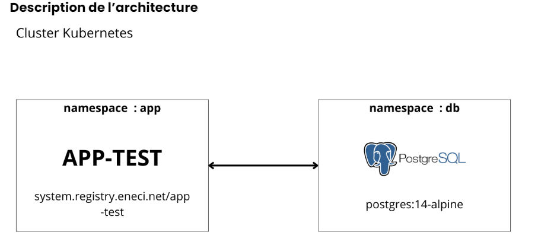

# Resultat TEST DE RECRUTEMENT DEVOPS ENGINEER data354

Ce test avait pour objectif d'évaluer mes compétences dans la conception, la mise en place et la maintenance d'un cluster Kubernetes, ainsi que dans le déploiement d'applications sur ce cluster. Il nous permettra également de vérifier vos connaissances en tant qu'ingénieur logiciel dans son ensemble, et plus spécifiquement en tant qu'ingénieur système.

Ma tâche était donc de déployer une suite d'applications dans un cluster Kubernetes que j'aurais apréalablement provisionné ou déployé localement, afin de répondre a une suite de questions.

#### Architecture:


## Objectif principale :

Récupérer les codes de validations qui permettront de passer à la phase suivante. Ces codes sont migrés et stockés de l'application app-test vers la base de données au premier lancement de l'application.


## Reponses aux questions

#### 1-Déployer ou provisionner un cluster kubernetes *

Pour le deploiement du cluster kubernetes j'ai choisit minikube car j'avais déjà installé sur ma machine depuis longtemps.
	installation minikube sur linux : 

```shell
curl -LO https://storage.googleapis.com/minikube/releases/latest/minikube-linux-amd64 &&
sudo install minikube-linux-amd64 /usr/local/bin/minikube &&
minikube start --driver=docker
```

J'ai aussi installé microk8s sur une machine virtuelle 
	installation microk8s sur linux : https://microk8s.io/docs/getting-started

```bash
sudo snap install microk8s --classic
```
```bash
sudo usermod -a -G microk8s $USER
```
```bash
sudo usermod -a -G microk8s $USER
```
```bash
sudo mkdir -p ~/.kube
```
```bash
sudo chown -f -R $USER ~/.kube
```
```bash
su - $USER
```
```bash
microk8s status --wait-ready
```
```bash
	alias kubectl='microk8s kubectl'
```
#### 1- Creation des differents namespaces

```shell
touch namespace.yml
```
```yaml
	apiVersion: v1
	kind: Namespace
	metadata:
  		name: db
	---
	apiVersion: v1
	kind: Namespace
	metadata:
  		name: app
```
```shell
kubectl apply -f namespace.yml
```

#### 1- Créer les manifestes kubernetes et déployer les applications postgresql (statefulset), app-test (deployement) en respectant les namespaces de chaque application (voir l'architecture ci-dessus)

##### Deploiement de la base de donnée postgresql


Ajouter votre mail de soumission au fichier lapp/data/email.txt dans le
conteneur de l'application (app-test) en cours
Récupérer les codes de validation en faisant une requête POST sur le
path "[codes" de l'url de l'application app-test en précisant dans le
header mail de soumission>


## Execution

- le lien du site hebergé : https://issiaka002.github.io/AQ54-project-sidibe-issiaka/
- une seule commande : 
    + docker run --name myapp -ti -p 8088:80 -d issiaka99/aq54:latest
- un docker-compose.yml:
```bash
    version: '3'
		services:
  			myWebApp:
    			image: issiaka99/aq54:latest
    			ports:
      				- "8081:80"
```
	+ docker-compose up -d

### Equipement utilisés

Machine Locale:

```bash
  Windows 11
  16 GiB RAM, 500 GiB Storage SSD
```

### Prérequis

- Docker (optional)
- un navigateur web 

## Perspective futures

On peut considerer ces perspectives futures suivantes :

- Implementer un systeme d'alert en temps réel pour notifier les utilisateurs des changements
- Analyser & faire du machine learning

## Conclusion

Ce projet montre l'utilisation de javascript vanilla pour mettre en place une plateforme de visualisation de donnée en temps réel et en differe.
