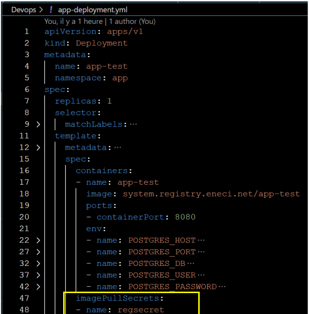
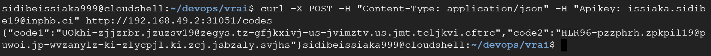

# Resultat TEST DE RECRUTEMENT DEVOPS ENGINEER data354 (issiaka.sidibe19@inphb.ci)

Ce test avait pour objectif d'évaluer mes compétences dans la conception, la mise en place et la maintenance d'un cluster Kubernetes, ainsi que dans le déploiement d'applications sur ce cluster. Il nous permettra également de vérifier vos connaissances en tant qu'ingénieur logiciel dans son ensemble, et plus spécifiquement en tant qu'ingénieur système.

Ma tâche était donc de déployer une suite d'applications dans un cluster Kubernetes que j'aurais apréalablement provisionné ou déployé localement, afin de répondre a une suite de questions.

#### Architecture:


## Objectif principale :

Récupérer les codes de validations qui permettront de passer à la phase suivante. Ces codes sont migrés et stockés de l'application app-test vers la base de données au premier lancement de l'application.

## Livrables :

##### + Les deux codes de validations que vous devez envoyés par mail lors de votre soumission:

{
	"code1":"UOkhi-zjjzrbr.jzuzsv19@zegys.tz-gfjkxivj-us-jvimztv",
 	"code2":"HLR96-pzzphrh.zpkpil19@puwoi.jp-wvzanylz-ki-zlycpjl"
}


##### + Etape de creation du cluster:

Pour le deploiement du cluster kubernetes j'ai choisit minikube car j'avais déjà installé sur ma machine depuis longtemps. <br/>
	installation minikube sur linux : 

```shell
curl -LO https://storage.googleapis.com/minikube/releases/latest/minikube-linux-amd64 &&
sudo install minikube-linux-amd64 /usr/local/bin/minikube &&
minikube start --driver=docker
```

J'ai aussi installé microk8s sur une machine virtuelle <br/>
	installation microk8s sur linux : https://microk8s.io/docs/getting-started

```bash
sudo snap install microk8s --classic
```
MicroK8s crée un groupe pour permettre une utilisation transparente des commandes qui nécessitent des privilèges d’administrateur. Pour ajouter votre utilisateur actuel au groupe et accéder au répertoire de mise en cache .kube, exécutez les trois commandes suivantes :
```bash
sudo usermod -a -G microk8s $USER
```
```bash
sudo usermod -a -G microk8s $USER
```
```bash
sudo mkdir -p ~/.kube
```
```bash
sudo chown -f -R $USER ~/.kube
```
```bash
su - $USER
```
MicroK8s dispose d’une commande intégrée pour afficher son état. Lors de l’installation, vous pouvez utiliser l’indicateur ----wait-ready pour attendre l’initialisation des services Kubernetes : 

```bash
microk8s status --wait-ready
```
MicroK8s utilise une commande kubectl dans l’espace de noms pour éviter les conflits avec les installations existantes de kubectl. Si vous n’avez pas d’installation existante, il est plus facile d’ajouter un alias (ajouter à ~/.bash_aliases) comme ceci :

```bash
	alias kubectl='microk8s kubectl'
```


##### + La méthode utilisée pour pull l'image app-test du référentiel docker privé :

Pour pull l'image app-test du référentiel docker privé j'ai suivie les etapes indiquées dans la documentation de kubernetes: https://kubernetes.io/docs/tasks/configure-pod-container/pull-image-private-registry/

```bash
docker login system.registry.eneci.net
```
J'ai saisir le username et le password qui m'a été fournis.
Le processus de connexion crée ou met à jour un fichier <i>config.json</i> qui contient un token d'autorisation.

Consultez le fichier <i>config.json</i> :
```bash
cat ~/.docker/config.json
```
voici le sortie:
```yml
{
"auths": {
			"system.registry.eneci.net": {
					"auth": "ZGF0YTM1NHRlc3Q6MmpZZGszRzk="
			}
        }
}
```

J'ai crée ce secret, en le nommant regsecret dans le namespace app en ligne de commande:
```shell
kubectl create secret docker-registry --namespace=app regsecret --docker-server=system.registry.eneci.net --docker-username=data354test --docker-password=2jYdk3G9
```

Verification: 
```shell
kubectl get secret -n app regsecret --output="jsonpath={.data.\.dockerconfigjson}" | base64 --decode
```
La sortie donne:
```yml
{"auths":{"system.registry.eneci.net":{"username":"data354test","password":"2jYdk3G9","auth":"ZGF0YTM1NHRlc3Q6MmpZZGszRzk="}}}
```
Ensuite il suffit d'utiliser le Secret *regsecret* dans mon manifest pour application app-test comme suite :



##### + La méthode utilisée pour la modification du fichier /app/data/mail.txt :

J'ai utilisé la commande :
```shell
kubectl exec < pods-name > -n app -- sh -c 'echo "issiaka.sidibe19@inphb.ci" > /app/data/mail.txt'
```


##### + La méthode utilisée pour communiquer avec l'application depuis l'extérieur du cluster :

Pour communiquer avec l'application depuis l'extérieur du cluster j'ai utilisé la Ressource Service de Kubernetes. 
```yml
apiVersion: v1
kind: Service
metadata:
  name: app-test-svc
  namespace: app
spec:
  # Sélecteur qui identifie les pods associés à ce service
  selector:
    app: app-test
  ports:
    # Définition du protocole utilisé (TCP dans ce cas)
    - protocol: "TCP"
      # Port sur lequel le service s'exécute dans le cluster
      port: 8080
      # Port cible exposé par le service
      targetPort: 8080
  # Type de service (NodePort dans ce cas)
  type: NodePort
```
Vu que j'utilise minikube, J'ai pris l'IP en executant la commande :
```shell
minikube ip
```
La sortie:
```shell
192.168.49.2
```
Ensuite avec Curl j'ai récuperé les codes:
```shell
curl -X POST \
  -H "Content-Type: application/json" \
  -H "Apikey: issiaka.sidibe19@inphb.ci" \
  http://192.168.49.2:31051/codes
```
J'ai récuperé le port de l'application grace a la commande:
```shell
kubectl get svc -n app
```


##### + La capture d'écran du client REST comprenant la requête et sa réponse :



---


## Reponses aux questions

#### 1-Déployer ou provisionner un cluster kubernetes *

#### 2- Creation des differents namespaces

```shell
touch namespace.yml
```
```yaml
apiVersion: v1
kind: Namespace
metadata:
	name: db
---
apiVersion: v1
kind: Namespace
metadata:
	name: app
```
```shell
kubectl apply -f namespace.yml
```

#### 3- Créer les manifestes kubernetes et déployer les applications postgresql (statefulset), app-test (deployement) en respectant les namespaces de chaque application (voir l'architecture ci-dessus)

##### Deploiement de la base de donnée postgresql

Pour le deploiement de la base de donnée, nous avons besoin de specifier un certain nombre de variable d'environnment. la meilleure pratique consiste à séparer les variables d’environnement à l’aide de ConfigMaps et à appeler ConfigMap à partir du déploiement StatefulSet. De plus pour les informations sensibles telles que le username et le password, il est conseillé d'utiliser les Secrets. 

Cela facilite la gestion et la maintenance de chaque composant du déploiement.

Par conséquent, créons un ConfigMap et un Secret pour la base de donnée postgresql. Le username et le password seront cryptés en base64

```shell
vi db-config.yml
```
```yaml
apiVersion: v1
kind: ConfigMap
metadata:
  name: db-config
  namespace: db
data:
  dbName: postgres-db
  pgdata: /var/lib/postgresql/data

---
apiVersion: v1
kind: Secret
metadata:
  name: postgres-secrets
  namespace: db
data:
  username: cm9vdA==
  password: cm9vdA==

```
```shell
kubectl apply -f db-config.yml
```
J'utilise la ressource k8S Statefulset. Les StatefulSets sont idéaux pour les déploiements de bases de données. Dans cet exemple, je crée un déploiement PostgreSQL en tant que StatefulSet avec un volume de stockage persistant

```shell
touch db-statefulset.yml
```
```yaml
# Définition du StatefulSet pour PostgreSQL
apiVersion: apps/v1
kind: StatefulSet
metadata:
  name: postgres-db
  namespace: db   # Ajout du namespace 'db'
spec:
  serviceName: postgres-db-service
  replicas: 1
  selector:
    matchLabels:
      app: postgres-db
      tier: database
  template:
    metadata:
      labels:
        app: postgres-db
        tier: database
    spec:
      containers:
        - name: postgresql-db
          image: postgres:14-alpine
          volumeMounts:
            - name: postgresql-storage
              mountPath: /var/lib/postgresql/data
          env:
            # Utilisation du nom d'utilisateur provenant du Secret 'postgres-secrets'
            - name: POSTGRES_USER
              valueFrom:
                secretKeyRef:
                  name: postgres-secrets
                  key: username
            # Utilisation du mot de passe provenant du Secret 'postgres-secrets'
            - name: POSTGRES_PASSWORD
              valueFrom:
                secretKeyRef:
                  name: postgres-secrets
                  key: password
            # Utilisation du chemin de stockage de données provenant de la ConfigMap 'db-config'
            - name: PGDATA
              valueFrom:
                configMapKeyRef:
                  name: db-config
                  key: pgdata
            # Utilisation du nom de la base de données provenant de la ConfigMap 'db-config'
            - name: POSTGRES_DB
              valueFrom:
                configMapKeyRef:
                  name: db-config
                  key: dbName
  # Définition du modèle de demande de volume
  volumeClaimTemplates:
    - metadata:
        name: postgresql-storage
      spec:
        accessModes: ["ReadWriteOnce"]
        resources:
          requests:
            storage: 1Gi

```
```shell
kubectl apply -f db-statefulset.yml
```
j'ai besoin d’un service pour l’exposer en dehors du cluster Kubernetes. Pour ce faire, je crée un service qui pointe vers le StatefulSet.

```shell
touch db-service.yml
```
```yaml
# Définition du Service pour PostgreSQL
apiVersion: v1
kind: Service
metadata:
  name: postgres-db-service
  namespace: db
  labels:
    app: postgres-db
    tier: database
spec:
  ports:
    # Définition du port sur lequel le service écoute
    - port: 5432
      # Port cible sur les pods correspondants
      targetPort: 5432
  selector:       
    # Sélection des pods correspondants avec les labels spécifiés
    app: postgres-db
    tier: database
  # ClusterIP None signifie que ce service n'aura pas d'IP interne et sera accessible uniquement à l'intérieur du cluster
  clusterIP: None
```
```shell
kubectl apply -f db-service.yml
```
Verification :
```shell
kubectl get all
```
Test de connection :
```shell
kubectl exec -it --namespace=db postgres-db-0 -- psql -h localhost -U root --password -p 5432 postgres-db
```

##### Deploiement de l'application:

```shell
vi app-config.yml
```
```yaml
apiVersion: v1
kind: ConfigMap
metadata:
  name: app-config
  namespace: app
data:
  host: postgres-db-service.db.svc.cluster.local
  dbName: postgres-db
  pgdata: /var/lib/postgresql/data
  port: "5432"

---
apiVersion: v1
kind: Secret
metadata:
  name: app-secrets
  namespace: app
data:
  username: cm9vdA==
  password: cm9vdA==


```
```shell
kubectl apply -f app-config.yml
```
Deploiement de app-test

```shell
vi app-deployment.yml
```
```yaml
apiVersion: apps/v1
kind: Deployment
metadata:
  name: app-test
  namespace: app
spec:
  replicas: 1
  selector:
    matchLabels:
      app: app-test
  template:
    metadata:
      labels:
        app: app-test
    spec:
      containers:
      - name: app-test
        image: system.registry.eneci.net/app-test
        ports:
        - containerPort: 8080
        env:
        - name: POSTGRES_HOST
          valueFrom:
            configMapKeyRef:
              name: app-config
              key: host
        - name: POSTGRES_PORT
          valueFrom:
            configMapKeyRef:
              name: app-config
              key: port
        - name: POSTGRES_DB
          valueFrom:
            configMapKeyRef:
              name: app-config
              key: dbName
        - name: POSTGRES_USER
          valueFrom:
            secretKeyRef:
              name: app-secrets
              key: username
        - name: POSTGRES_PASSWORD
          valueFrom:
            secretKeyRef:
              name: app-secrets
              key: password
      imagePullSecrets:
      - name: regsecret
```
```shell
kubectl apply -f app-deployment.yml
```
Service app-test
```shell
vi app-service.yml
```

```yml
apiVersion: v1
kind: Service
metadata:
  name: app-test-svc
  namespace: app
spec:
  selector:
    app: app-test
  ports:
    - protocol: "TCP"
      port: 8080
      targetPort: 8080
  type: NodePort

```
```shell
vi app-service.yml
```

L'application app-test est deployé avec succès.


### Equipement utilisés

Machine Locale:

```bash
  Windows 11
  16 GiB RAM, 500 GiB Storage SSD
```

### Prérequis

- Un cluster kubernetes

## Conclusion


